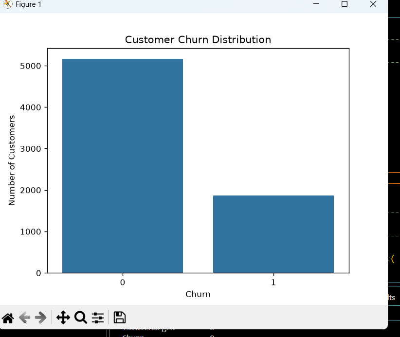
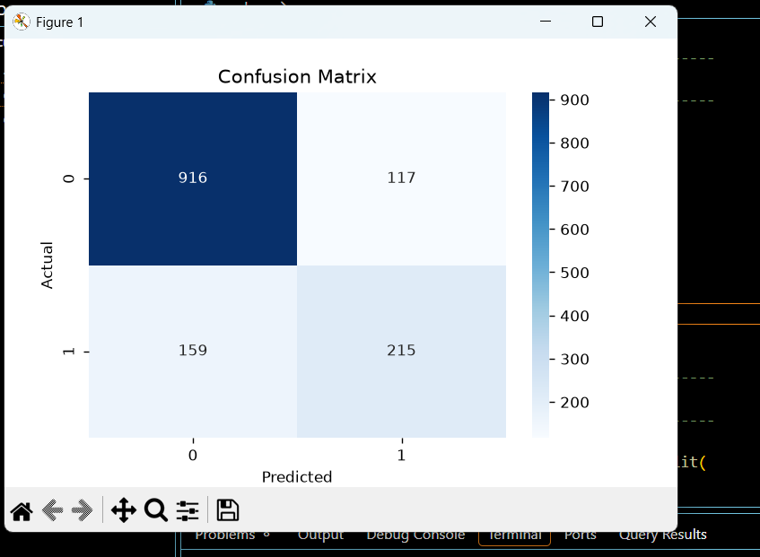

# Customer Churn Prediction

## About the Project

Customer Churn Prediction is a Machine Learning project that predicts whether a customer is likely to leave a company's service.

The main goal of this project is to help a company identify customers who may churn so that it can take actions such as offering discounts, better plans, or improved support to retain them.

## Why This Project?

Customer churn is an important business problem. Losing existing customers can affect a company's revenue.

By using historical customer data, a Machine Learning model can learn patterns associated with customers who stay or leave.

In this project, we use customer information such as:

- Tenure
- Contract type
- Internet service
- Monthly charges
- Total charges
- Payment method
- Other customer service details

The model then predicts:

- `0` → Customer is likely to stay
- `1` → Customer is likely to churn

## Dataset

The project uses a Telco Customer Churn dataset containing customer information and their churn status.

The original dataset contains:

- 7,043 customer records
- 21 columns

After data cleaning, the project uses 7,032 valid records.

The target column is `Churn`.

## Technologies Used

- Python
- Pandas
- NumPy
- Matplotlib
- Seaborn
- Scikit-learn

## Machine Learning Model

This project uses **Logistic Regression** for binary classification.

The model predicts one of two outcomes:

- Stay
- Churn

## Project Workflow

The project follows these steps:

1. Load the customer dataset.
2. Explore the first few records and dataset information.
3. Check for missing values.
4. Convert `TotalCharges` into numeric format.
5. Remove rows containing missing values.
6. Remove `customerID` because it is only an identifier and does not help with prediction.
7. Convert the `Churn` target from `Yes/No` to `1/0`.
8. Perform Exploratory Data Analysis (EDA).
9. Separate input features (`X`) and target (`y`).
10. Convert categorical features into numerical features using one-hot encoding.
11. Split the data into training and testing sets.
12. Scale the features using `StandardScaler`.
13. Train the Logistic Regression model.
14. Make predictions on the testing data.
15. Evaluate the model using accuracy, precision, recall, F1-score, and a confusion matrix.
16. Make a final churn/stay prediction for a sample customer.

## Exploratory Data Analysis

The project creates a **Customer Churn Distribution** chart to understand how many customers stayed and how many churned.

After cleaning:

- Customers who stayed: **5,163**
- Customers who churned: **1,869**

This shows that the dataset contains more customers who stayed than customers who churned.

## Train-Test Split

The cleaned data is divided into:

- Training data: **5,625 records**
- Testing data: **1,407 records**

The training data is used to teach the Machine Learning model, while the testing data is used to evaluate how well the model performs on unseen data.

## Results

The Logistic Regression model achieved:

**Accuracy: 80.38%**

### Classification Report

| Class | Meaning | Precision | Recall | F1-Score |
|------:|---------|----------:|-------:|---------:|
| 0 | Stay | 0.85 | 0.89 | 0.87 |
| 1 | Churn | 0.65 | 0.57 | 0.61 |

The model performs better at identifying customers who stay than customers who churn.

The churn recall is **0.57**, which means the model correctly identified about 57% of the customers who actually churned in the test set. This indicates that there is room for improvement in detecting churn customers.

## Confusion Matrix

The confusion matrix from the test set is:

| Actual / Predicted | Stay (0) | Churn (1) |
|--------------------|---------:|----------:|
| Stay (0)           | 916 | 117 |
| Churn (1)          | 159 | 215 |

This means:

- **916** customers were correctly predicted as staying.
- **117** customers were predicted to churn but actually stayed.
- **159** customers actually churned but were predicted to stay.
- **215** customers were correctly predicted as churn.

## Example Prediction

The program also makes a prediction for a sample customer.

Example output:

```text
Prediction: Customer is likely to CHURN.
```

Here:

- `1` means likely to churn.
- `0` means likely to stay.

## How to Run the Project

### 1. Clone the repository

```bash
git clone YOUR_GITHUB_REPOSITORY_URL
```

### 2. Open the project folder

```bash
cd customer-churn-project
```

### 3. Install the required libraries

```bash
pip install pandas numpy matplotlib seaborn scikit-learn
```

### 4. Run the Python program

```bash
python code.py
```

The program will display:

- First 5 rows of the dataset
- Dataset information
- Missing-value information
- Churn distribution
- Training/testing data size
- Model accuracy
- Classification report
- Confusion matrix
- Final churn/stay prediction

## Future Improvements

This project can be improved by:

- Testing additional Machine Learning algorithms such as Random Forest and Decision Tree.
- Improving the recall for the churn class.
- Using cross-validation and hyperparameter tuning.
- Adding churn probability to the final prediction.
- Building a simple web interface for predictions.

## Conclusion

## Visualizations

### Customer Churn Distribution



### Confusion Matrix




This project demonstrates how Machine Learning can be used to solve a real-world business problem.

By analyzing customer information and training a Logistic Regression model, the project predicts whether a customer is likely to stay or churn.

The current model achieves **80.38% accuracy**, while also showing that further improvements could be made to better identify customers who are likely to churn.
